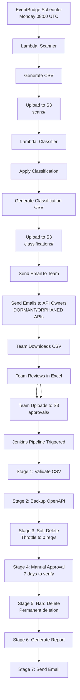

# 🎉 Implementation Complete - CSV-Based API Cleanup Workflow

## 📋 Summary

Successfully implemented a comprehensive CSV-based manual approval workflow for AWS API Gateway cleanup. The team can now review and approve API deletions through a simple CSV file, with full audit trail and safety controls.

---

## 📁 Files Created/Updated

### ✅ Lambda Functions

| File | Status | Description |
|------|--------|-------------|
| `lambdas/lambda_scanner.py` | ✅ **UPDATED** | Scans APIs and generates CSV to S3 |
| `lambdas/lambda_classifier.py` | ✅ **UPDATED** | Classifies APIs and sends email with CSV |

### ✅ Jenkins Pipeline

| File | Status | Description |
|------|--------|-------------|
| `Jenkinsfile-decommission` | ✅ **NEW** | Complete decommission pipeline (7 stages) |

### ✅ PowerShell Scripts

| File | Status | Description |
|------|--------|-------------|
| `jps.ps1` | ✅ **UPDATED** | Fixed CloudWatch metrics querying |

### ✅ Documentation

| File | Status | Description |
|------|--------|-------------|
| `README-CSV-WORKFLOW.md` | ✅ **NEW** | Comprehensive guide for CSV workflow |
| `IMPLEMENTATION-SUMMARY.md` | ✅ **NEW** | Technical implementation details |
| `QUICKSTART-GUIDE.md` | ✅ **NEW** | Simple guide for reviewers |
| `aaguacv1.md` | ✅ **UPDATED** | Updated automation approach section |

---

## 🔄 Complete Workflow



---

## 📊 CSV Schemas

### Scanner Output (18 columns)
```
ScanDate, AccountId, AccountName, Region, ApiId, ApiName, ApiType, 
CreatedDate, HasStages, StageNames, HasCustomDomain, HasUsagePlan, 
InvocationCount90d, LastInvocationDate, AvgRequestsPerDay, 
OwnerEmail, TeamTag, Tags
```

### Classifier Output (+ 8 columns)
```
+ Tier, TierReason, ClassifiedDate, RecommendedAction,
  ApprovalStatus, ReviewerName, ReviewerComments, ReviewDate
```

### Deletion Report (+ 6 columns)
```
+ BackupS3Key, SoftDeleteDate, HardDeleteDate,
  DeletionStatus, DeletionError, JenkinsJobUrl
```

---

## 🎯 Key Features

### ✅ Safety & Control
- **Manual approval at every step** - No automated deletions
- **Two-stage deletion** - Soft delete → 7 days → Hard delete
- **Complete backups** - OpenAPI specs backed up before deletion
- **DRY RUN mode** - Test without actual deletions

### ✅ Audit & Transparency
- **CSV-based audit trail** - Every decision documented
- **Email notifications** - At scan, classification, and completion
- **Owner notifications** - Individual emails to API owners for unused APIs
- **Comprehensive reports** - Success/failure details
- **Jenkins job history** - Full pipeline logs

### ✅ Flexibility
- **Per-API decisions** - APPROVE_DELETE / KEEP / EXTEND_REVIEW
- **Team collaboration** - Multiple reviewers can work on same CSV
- **Configurable thresholds** - Adjust LOW_TRAFFIC_THRESHOLD, DORMANT_DAYS
- **Multi-region support** - Scans all enabled AWS regions

### ✅ CloudWatch Integration
- **Accurate metrics** - Fixed dimension querying in jps.ps1
- **90-day lookback** - Comprehensive traffic analysis
- **Last invocation tracking** - Know when API was last used
- **Average requests/day** - Easy to spot low-traffic APIs

---

## 🚀 Deployment Checklist

### 1. Lambda Functions
- [ ] Deploy `lambda_scanner.py` to AWS Lambda
- [ ] Deploy `lambda_classifier.py` to AWS Lambda
- [ ] Set environment variables (S3_BUCKET, NOTIFICATION_EMAILS, etc.)
- [ ] Configure EventBridge trigger for scanner (Monday 08:00 UTC)
- [ ] Test scanner manually and verify CSV output
- [ ] Test classifier manually and verify email

### 2. S3 Bucket
- [ ] Create bucket: `api-gateway-cleanup-bucket`
- [ ] Create folders: `scans/`, `classifications/`, `approvals/`, `backups/`, `reports/`
- [ ] Enable versioning
- [ ] Enable encryption (SSE-S3 or KMS)
- [ ] Set lifecycle policy (e.g., delete after 90 days)
- [ ] Configure bucket policy for Lambda access

### 3. IAM Roles
- [ ] Create Lambda execution role with required permissions
- [ ] Create Jenkins role with API Gateway delete permissions
- [ ] Attach policies for S3, CloudWatch, SES, API Gateway
- [ ] Test permissions with dry run

### 4. SES Email
- [ ] Verify sender email: `noreply@company.com`
- [ ] Verify recipient emails:
  - [ ] mdziaur.rahman@corebridgefinancial.com
  - [ ] mdziaur.rahman@mphasis.com
  - [ ] sust.cse.zia@gmail.com
- [ ] Move SES out of sandbox (if needed)
- [ ] Test email sending from Lambda

### 5. Jenkins Pipeline
- [ ] Create new Jenkins job: `api-gateway-decommission`
- [ ] Configure SCM: Point to `Jenkinsfile-decommission`
- [ ] Set up AWS credentials in Jenkins
- [ ] Configure approval groups (`api-admins`, `platform-team`)
- [ ] Test with DRY_RUN=true
- [ ] Set up S3 event trigger (optional)

### 6. Documentation & Training
- [ ] Share QUICKSTART-GUIDE.md with API team
- [ ] Schedule training session for reviewers
- [ ] Create Slack channel: #api-cleanup
- [ ] Set up runbook in Confluence/Wiki
- [ ] Document escalation process

---

## 📧 Email Configuration

Emails will be sent to:
- **mdziaur.rahman@corebridgefinancial.com**
- **mdziaur.rahman@mphasis.com**
- **sust.cse.zia@gmail.com**

Update in Lambda environment variable:
```bash
NOTIFICATION_EMAILS=mdziaur.rahman@corebridgefinancial.com,mdziaur.rahman@mphasis.com,sust.cse.zia@gmail.com
```

---

## 🧪 Testing Plan

### Phase 1: Lambda Testing (Week 1)
1. Deploy scanner Lambda
2. Run manually with test account
3. Verify CSV generated in S3
4. Check CSV format and data accuracy
5. Deploy classifier Lambda
6. Run manually with scanner output
7. Verify classification logic
8. Verify email received with correct content

### Phase 2: Pipeline Testing (Week 2)
1. Deploy Jenkins pipeline
2. Create test approved CSV with 1-2 test APIs
3. Run pipeline with DRY_RUN=true
4. Verify all stages execute correctly
5. Check backup files in S3
6. Verify report generation

### Phase 3: Pilot (Week 3)
1. Run real scan in production
2. Team reviews 5-10 APIs
3. Run pipeline with APPROVE_DELETE on test APIs
4. Verify soft delete works (throttling)
5. Wait 7 days and verify no impact
6. Complete hard delete
7. Review deletion report

### Phase 4: Full Rollout (Week 4+)
1. Run weekly scans
2. Team reviews all classifications
3. Process approved deletions
4. Monitor for issues
5. Iterate on thresholds as needed

---

## 📈 Success Metrics

Track these KPIs weekly:
- **APIs Scanned**: Total APIs discovered
- **APIs Classified**: Breakdown by tier (ACTIVE/LOW_TRAFFIC/DORMANT/ORPHANED)
- **APIs Reviewed**: How many reviewed by team
- **Approval Rate**: % approved for deletion
- **Deletion Success Rate**: % successfully deleted
- **Cost Savings**: Estimated monthly savings from deleted APIs
- **Review Time**: Average time team spends reviewing

---

## 🐛 Known Issues & Limitations

### CloudWatch Metrics
- **Issue**: Some APIs may show 0 invocations if detailed metrics not enabled
- **Solution**: Enable detailed metrics on API Gateway stages
- **Workaround**: Check CloudTrail logs as alternative

### Cross-Account APIs
- **Issue**: Current implementation scans single account
- **Solution**: Run Lambda in each account or use cross-account roles
- **Workaround**: Manual consolidation of CSVs from multiple accounts

### API Gateway Limits
- **Issue**: AWS API Gateway API limits may throttle bulk operations
- **Solution**: Add exponential backoff and retry logic
- **Workaround**: Process APIs in smaller batches

---

## 🔮 Future Enhancements

### Short Term (1-3 months)
- [ ] Add Slack notifications (in addition to email)
- [ ] Create web dashboard for CSV review (instead of Excel)
- [ ] Add CloudTrail log analysis for more accurate usage detection
- [ ] Implement cross-account scanning

### Medium Term (3-6 months)
- [ ] Auto-detect API dependencies (via X-Ray traces)
- [ ] Integration with CMDB/service catalog
- [ ] Cost impact calculation per API
- [ ] Automated test API creation for validation

### Long Term (6-12 months)
- [ ] ML-based classification (predict which APIs are safe to delete)
- [ ] Auto-remediation for obvious orphaned APIs
- [ ] Integration with change management systems
- [ ] Real-time alerting for new unused APIs

---

## 📚 Related Documentation

1. **README-CSV-WORKFLOW.md** - Complete technical guide
2. **QUICKSTART-GUIDE.md** - Simple guide for reviewers
3. **IMPLEMENTATION-SUMMARY.md** - Technical details
4. **aaguacv1.md** - Original design document
5. **Jenkinsfile-decommission** - Pipeline code with comments

---

## 🙏 Acknowledgments

**Implemented by**: Md Ziaur Rahman
- mdziaur.rahman@corebridgefinancial.com
- mdziaur.rahman@mphasis.com
- sust.cse.zia@gmail.com

**Implementation Date**: April 30, 2026

**Status**: ✅ **COMPLETE & READY FOR DEPLOYMENT**

---

## 📞 Support

For questions or issues:
1. Check QUICKSTART-GUIDE.md
2. Check README-CSV-WORKFLOW.md troubleshooting section
3. Email: mdziaur.rahman@corebridgefinancial.com
4. Slack: #api-platform (coming soon)

---

**🎊 CONGRATULATIONS! The CSV-based API cleanup workflow is complete and ready to deploy! 🎊**
